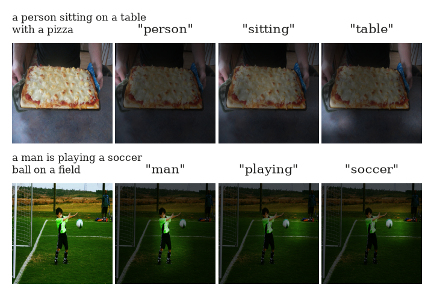
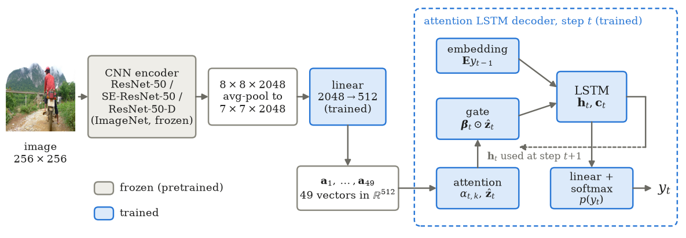
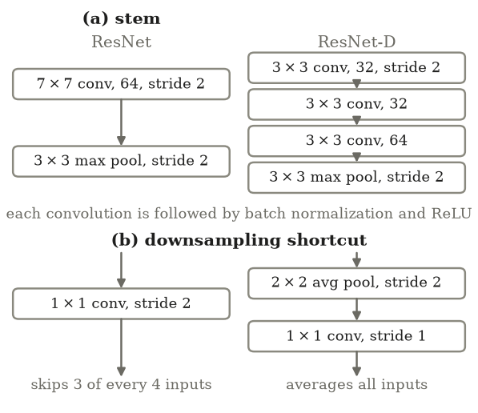
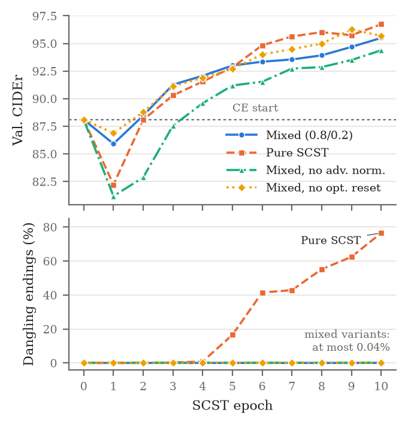
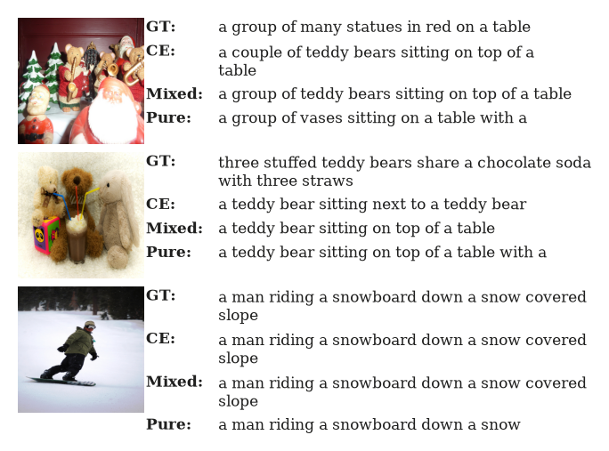

# Stabilized Reinforcement Learning for Image Captioning using SE-ResNet-D

**Manas Mehta, Vishvesh Sharma, Dr. Madhuri Chopade** · CSE, GLS University, Ahmedabad, India
IEEE MINDS 2026 · Paper source: [`paper/main.tex`](paper/main.tex)

## Abstract

Self-Critical Sequence Training (SCST) lets an image captioning model optimize its evaluation metric directly, but the switch from cross-entropy (CE) training to reinforcement learning can destabilize the model and push it toward repetitive, metric-seeking captions. We study this transition in a lightweight attention-based CNN-LSTM captioner trained on a single 4 GB consumer GPU. For the encoder, we compare ImageNet-pretrained ResNet-50 models with and without Squeeze-and-Excitation (SE) blocks and the ResNet-D stem and downsampling path, all pretrained with the same recipe. For training, we analyze a mixed objective that weights the SCST loss by 0.8 and the CE loss by 0.2, combined with normalized advantages and an optimizer reset at the CE-to-RL switch, and we ablate each component. On the Karpathy test split of MS-COCO, the ResNet-D encoder gives the best CE model, with 31.3 BLEU-4 and 98.2 CIDEr, while SE blocks give no measurable gain. Beyond the standard metrics, we measure reward hacking directly. Pure SCST raises CIDEr but ends 77.9% of its test captions with a function word such as "a" or "with". The mixed objective keeps this rate at zero for a cost of 1.8 CIDEr, and normalizing the advantage makes the switch to reinforcement learning smoother.

<p align="center"></p>

*Fig. 1. Attention of the mixed SCST model on randomly drawn Karpathy test images, with the greedy caption above each image. Each map brightens the regions weighted by α<sub>t</sub> when the word above it was generated.*

## Contributions

- A controlled comparison of ResNet-50, SE-ResNet-50, and ResNet-50-D encoders, pretrained with the same recipe and paired with the same decoder.
- An ablation of a stabilized SCST setup: a mixed 80/20 SCST/CE objective, normalized advantages, and an optimizer reset at the CE-to-RL switch.
- A direct measurement of reward hacking through vocabulary usage, caption uniqueness, n-gram diversity, and repetition.

## Method

<p align="center"></p>

*Fig. 2. Model overview. A frozen ImageNet-pretrained encoder produces a 7×7×2048 feature map, which is projected to 49 vectors of dimension 512. At each step, the LSTM decoder attends over these vectors and generates the next word.*

### Encoder

We compare three encoders that share the ResNet-50 backbone:

- **ResNet-50**, the baseline.
- **SE-ResNet-50**, which adds a Squeeze-and-Excitation block (reduction ratio r = 16) to every bottleneck. It pools each channel globally, passes the result through a two-layer bottleneck, and rescales each channel:

$$z_c = \frac{1}{HW}\sum_{i=1}^{H}\sum_{j=1}^{W} u_c(i,j), \qquad \mathbf{s} = \sigma\left(\mathbf{W}_2\,\delta(\mathbf{W}_1\mathbf{z})\right), \qquad \tilde{\mathbf{u}}_c = s_c\,\mathbf{u}_c$$

- **ResNet-50-D**, which replaces the 7×7 stem convolution with three 3×3 convolutions and inserts 2×2 average pooling before the 1×1 projection in the downsampling shortcut (Fig. 3). In both our baseline and ResNet-50-D, the stride of each downsampling bottleneck sits in its 3×3 convolution, so these two changes are the only difference between them.

All three are pretrained on ImageNet-1k with the same recipe (timm `a1_in1k`, "ResNet strikes back"). We know of no publicly available SE-ResNet-50-D pretrained with this recipe, so we evaluate the two modifications separately. The encoders are frozen: a 256×256 input gives an 8×8×2048 feature map, average-pooled to 7×7 and projected by a trainable linear layer to 49 vectors of dimension 512.

<p align="center"></p>

*Fig. 3. The two ResNet-D modifications. (a) The 7×7 stem convolution is replaced by three 3×3 convolutions. (b) In the downsampling shortcut, a stride-2 1×1 convolution, which skips three of every four positions, is replaced by 2×2 average pooling followed by a stride-1 1×1 convolution.*

### Attention-based LSTM decoder

The decoder follows the soft-attention model of Show, Attend and Tell. At step t:

$$e_{t,k} = \mathbf{w}^{\top}\mathrm{ReLU}\left(\mathbf{W}_a\mathbf{a}_k + \mathbf{W}_h'\mathbf{h}_{t-1}\right), \qquad \alpha_{t,k} = \frac{\exp(e_{t,k})}{\sum_j \exp(e_{t,j})}, \qquad \hat{\mathbf{z}}_t = \sum_k \alpha_{t,k}\,\mathbf{a}_k$$

$$\boldsymbol{\beta}_t = \sigma\left(\mathbf{W}_\beta\mathbf{h}_{t-1}\right), \qquad \mathbf{x}_t = \left[\mathbf{E}y_{t-1};\ \boldsymbol{\beta}_t\odot\hat{\mathbf{z}}_t\right]$$

The gate β lets the decoder reduce its reliance on visual context, for example for function words. The next-word distribution is softmax(W<sub>o</sub> Dropout(h<sub>t</sub>)). Embedding, hidden, and attention dimensions are all 512.

### Training objectives

**Cross-entropy** with teacher forcing:

$$L_{\mathrm{CE}} = -\frac{1}{T}\sum_{t=1}^{T}\log p_\theta\left(y^{*}_t \mid y^{*}_{<t}, I\right)$$

**Self-critical sequence training.** For each image we sample a caption w<sup>s</sup> and decode a greedy caption w<sup>g</sup>, both scored with CIDEr-D against all references (document frequencies from the full training set). The greedy reward is the baseline:

$$L_{\mathrm{SCST}} = -\frac{1}{B}\sum_{i=1}^{B}\hat{A}_i\,\log p_\theta\left(w^{s}_i\right)$$

**Normalized advantage.** The raw advantage A<sub>i</sub> = r(w<sup>s</sup><sub>i</sub>) − r(w<sup>g</sup><sub>i</sub>) is standardized within the batch:

$$\hat{A}_i = \frac{A_i - \mu_A}{\sigma_A + \epsilon}$$

**Mixed objective.** Following Paulus et al., part of the CE loss is kept, using one randomly chosen reference per image:

$$L = \lambda\,L_{\mathrm{SCST}} + (1-\lambda)\,L_{\mathrm{CE}}, \qquad \lambda = 0.8$$

**Optimizer reset.** At the CE-to-SCST switch, the Adam moment estimates from CE training are discarded and a fresh Adam optimizer starts with the lower SCST learning rate.

## Experimental setup

- **Data.** MS-COCO with the Karpathy split: 113,287 training images (including "restval"), 5,000 validation, 5,000 test. Vocabulary of 9,490 tokens (words appearing more than five times, plus special tokens). Images resized to 256×256 with ImageNet normalization; features cached once, no augmentation.
- **Training.** One NVIDIA GeForce RTX 3050 Laptop GPU (4 GB). Adam with weight decay 10⁻⁴, element-wise gradient clipping at 2.0, dropout 0.5.
  - *CE stage:* learning rate 4×10⁻⁴, up to 20 epochs, 16 images per batch with all their captions. The learning rate halves after two epochs without validation-CIDEr improvement; training stops after three.
  - *SCST stage:* SE-ResNet-50 encoder (chosen before the encoder comparison finished; see [`DECISIONS.md`](DECISIONS.md)), learning rate 5×10⁻⁵, 10 epochs, 32 images per batch, captions up to 20 words.
  - *Model selection:* highest validation CIDEr under greedy decoding. The test split is used only for the final evaluation.
- **Evaluation.** Beam size 7, length penalty α = 0.7, minimum length 5, 4-gram blocking. BLEU-1–4, METEOR, ROUGE-L, and CIDEr-D from the official COCO caption code (PTB tokenizer, all references). Reward-hacking statistics: distinct words used, share of unique captions, distinct-2, share of captions repeating a content word, and share ending in a function word.

## Results

### Comparison with published models (Karpathy test, scores ×100)

| Model | Encoder | B-1 | B-4 | M | R | C | Training |
|---|---|---|---|---|---|---|---|
| Deep VS | VGG-16 | 62.5 | 23.0 | 19.5 | – | 66.0 | CE |
| Soft attention | VGG-19 | 70.7 | 24.3 | 23.9 | – | – | CE |
| Hard attention | VGG-19 | 71.8 | 25.0 | 23.0 | – | – | CE |
| Att2in | ResNet-101 | – | 31.3 | 26.0 | 54.3 | 101.3 | SCST |
| Up-Down | Faster R-CNN | 79.8 | 36.3 | 27.7 | 56.9 | 120.1 | SCST |
| AoANet | Faster R-CNN | 80.2 | 38.9 | 29.2 | 58.8 | 129.8 | SCST |
| M² Transformer | Faster R-CNN | 80.8 | 39.1 | 29.2 | 58.6 | 131.2 | SCST |
| **Ours, from scratch**† | SE-ResNet-50 (COCO only) | 62.7 | 22.1 | 19.3 | 45.9 | 61.0 | mixed SCST |
| **Ours, CE** | SE-ResNet-50 (ImageNet) | 72.0 | 31.3 | 25.0 | 53.3 | 96.5 | CE |
| **Ours, CE** | ResNet-50-D (ImageNet) | 71.9 | 31.3 | 25.4 | 53.5 | 98.2 | CE |
| **Ours, mixed SCST** | SE-ResNet-50 (ImageNet) | 72.7 | 28.6 | 24.0 | 52.8 | 96.8 | 0.8 SCST + 0.2 CE |

B-n: BLEU-n, M: METEOR, R: ROUGE-L, C: CIDEr-D. †Deep 3×3 stem; no ImageNet pretraining, stem and first stage left at random initialization, and SCST learning rate 10⁻⁶. Not comparable to the encoder ablation.

Our CE models reach 31.3 BLEU-4, above the CNN-LSTM models of Karpathy and Fei-Fei and of Xu et al., and equal to Att2in, which uses a larger ResNet-101 encoder and SCST. Their CIDEr of 96.5 to 98.2 is below Att2in's 101.3, and models built on object-detector features remain 22 to 33 CIDEr points higher.

### Encoder ablation (CE training)

| Encoder | B-1 | B-4 | M | R | C |
|---|---|---|---|---|---|
| ResNet-50 | 71.6 | 30.7 | 25.2 | 53.3 | 96.7 |
| SE-ResNet-50 | **72.0** | **31.3** | 25.0 | 53.3 | 96.5 |
| ResNet-50-D | 71.9 | **31.3** | **25.4** | **53.5** | **98.2** |

ResNet-50-D gives the best CIDEr, 1.5 points above the baseline, and its lead holds under greedy decoding (90.6 versus 89.6) and on the validation split (90.2 versus 88.4). SE-ResNet-50 is within 0.2 CIDEr of the baseline, so we see no clear benefit from SE blocks with a frozen encoder. Each encoder was trained once.

### Training-objective ablation (SE-ResNet-50)

| Objective | B-1 | B-4 | M | R | C | Vocab | Uniq. | D-2 | Rep. | Dangl. | Len. |
|---|---|---|---|---|---|---|---|---|---|---|---|
| CE only | 72.0 | 31.3 | 25.0 | 53.3 | 96.5 | 419 | 50.4 | 3.5 | 13.4 | 0.0 | 9.4 |
| Pure SCST (λ = 1) | 73.7 | 28.2 | 23.9 | 52.1 | 98.6 | 212 | 32.7 | 1.7 | 1.3 | 77.9 | 9.7 |
| Mixed SCST (λ = 0.8) | 72.7 | 28.6 | 24.0 | 52.8 | 96.8 | 241 | 29.3 | 1.6 | 2.5 | 0.0 | 9.1 |
| w/o advantage normalization | 72.1 | 27.9 | 23.8 | 52.5 | 95.5 | 236 | 28.5 | 1.5 | 4.2 | 0.0 | 9.1 |
| w/o optimizer reset | 72.8 | 28.8 | 24.2 | 53.0 | 97.6 | 243 | 31.3 | 1.7 | 5.2 | 0.0 | 9.1 |

Vocab: distinct words used; Uniq.: % unique captions; D-2: distinct-2; Rep.: % captions with a repeated content word; Dangl.: % captions ending in a function word; Len.: mean length.

- **SCST versus CE.** SCST removes most repetition (13.4% to 2.5% mixed, 1.3% pure). With greedy decoding, mixed SCST raises CIDEr from 88.7 to 97.1; with beam search the gap shrinks to 0.3 and BLEU-4 drops by 2.7. All SCST variants narrow the output: 212 to 243 words used instead of 419, and 28% to 33% unique captions instead of 50%.
- **Pure versus mixed.** Pure SCST reaches the highest CIDEr (98.6), but 77.9% of its captions end in a function word, mostly "with a" (64% of all captions), as in "a plane is sitting on the runway with a" or "a kitchen with a sink and a", where the mixed model writes "a kitchen with a sink and a window". CIDEr does not penalize these unfinished endings. Keeping 20% of the CE loss removes them for 1.8 CIDEr. Neither objective preserves caption diversity: unique captions fall to 29% (mixed) and 33% (pure).
- **Advantage normalization.** Without it, the policy-gradient term is about ten times larger at the start of SCST, validation CIDEr drops from 88.1 to 81.2 in the first epoch (85.9 with normalization), and the model ends 1.3 CIDEr lower on test.
- **Optimizer reset.** Keeping the CE Adam state gives 97.6 CIDEr, 0.8 above the run with a reset; with one run per setting we find no benefit from the reset.

<p align="center"></p>

*Fig. 4. Validation CIDEr (greedy decoding, top) and share of captions ending in a function word (bottom) per SCST epoch, starting from the same CE checkpoint (epoch 0). Pure SCST starts producing dangling endings in epoch 3 and reaches 76.4% by epoch 10; the mixed runs stay at or below 0.04%.*

### Effect of decoding

| Model | Greedy | Beam 3, plain | Beam 7 + heuristics |
|---|---|---|---|
| CE (CIDEr) | 88.7 | 96.0 | 96.5 |
| Mixed SCST (CIDEr) | 97.1 | 96.8 | 96.8 |

The length penalty, minimum length, and n-gram blocking change CIDEr by at most 0.5, so the results do not depend on them. Beam search adds 7.3 to 7.8 CIDEr for the CE model and slightly lowers it for the mixed SCST model.

### From-scratch run

Our first experiment trained an SE-ResNet-50 with a deep 3×3 stem from scratch on MS-COCO, without ImageNet pretraining (`train.py`, `models.py`), in three stages: CE with a frozen encoder, CE fine-tuning of the deeper encoder stages, and mixed SCST. In the retained epoch-87 checkpoint, the stem and the first residual stage are still at their random initialization, since they stayed frozen in every stage; stages 2 to 4 were learned. Its SCST stage used a learning rate of 10⁻⁶, which changes the model only slightly. It reaches 22.1 BLEU-4 and 61.0 CIDEr, a result that motivated the controlled comparison of pretrained encoders above.

### Qualitative examples

<p align="center"></p>

*Fig. 5. Captions for three randomly drawn Karpathy test images from the CE, mixed SCST, and pure SCST models (SE-ResNet-50 encoder, beam search), with one reference caption (GT).*

On the snowboarding image, the CE and mixed models reproduce the reference exactly, while pure SCST stops at "down a snow"; its other two captions end in "with a". All models also make content errors: every model calls the Christmas figurines teddy bears or vases, and the CE model repeats itself.

### Limitations

The encoders are frozen; fine-tuning them could improve all models. SE and ResNet-D are evaluated separately because no SE-ResNet-50-D pretrained with the same recipe is available. Each configuration was trained once, so differences of about one CIDEr point or less (SE versus the baseline, the optimizer-reset ablation) are inconclusive. The diversity and repetition statistics measure specific failure modes and are not a complete measure of fluency.

## Reproducing the results

**1. Environment.** Python 3.10+ and PyTorch with CUDA. METEOR and the PTB tokenizer in `pycocoevalcap` need Java (a JRE on the `PATH`).

```bash
pip install -r requirements.txt
```

**2. Data.** MS-COCO 2014 images and the Karpathy split:

```
data/coco/images/train2014/                 # http://images.cocodataset.org/zips/train2014.zip
data/coco/images/val2014/                   # http://images.cocodataset.org/zips/val2014.zip
data/coco/annotations/dataset_coco.json     # from caption_datasets.zip (Karpathy split)
```

**3. Vocabulary and features.**

```bash
python build_wordmap.py            # 9,490-token vocabulary
python cache_timm_features.py      # features for all three encoders, all splits (~75 GB)
```

**4. Training.** Runs the three CE encoders, then the four SCST variants. Rerunning skips finished jobs and resumes partial ones; a `runs/PAUSE` file pauses the current job and `runs/STOP` stops it after the current epoch.

```bash
python run_queue.py main
```

**5. Evaluation and figures.**

```bash
python evaluate_features.py runs/scst_mixed_se_s0                                                   # paper protocol
python evaluate_features.py runs/scst_mixed_se_s0 --beam 3 --alpha 0 --min_len 0 --block_ngram 0   # plain beam search
python evaluate_features.py runs/scst_mixed_se_s0 --beam 1 --alpha 0 --min_len 0 --block_ngram 0   # greedy
python make_figures.py
python make_diagrams.py
```

Trained checkpoints are not stored in git because of their size.

## Repository layout

| Path | Contents |
|---|---|
| `paper/` | LaTeX source (`main.tex`) and figures |
| `results/` | Test-set metrics and all generated captions for every model and decoding setting (JSON) |
| `runs/*/log.jsonl`, `runs/*/config.json` | Per-epoch validation metrics and the exact configuration of every training run |
| `DECISIONS.md` | Experimental decisions logged with timestamps, made before the results they affect |
| `cache_timm_features.py` | Runs the frozen timm encoders once and caches 7×7×2048 features |
| `train_decoder.py` | Trains the decoder on cached features (CE, pure SCST, or mixed), with pause, stop, and resume |
| `cider_d.py` | CIDEr-D reward with document frequencies from the training set |
| `run_queue.py` | Runs all experiments of the paper in order, one at a time |
| `evaluate_features.py` | Test evaluation of the cached-feature models |
| `evaluate_coco.py` | Test evaluation of end-to-end checkpoints (used for the from-scratch run) |
| `make_figures.py`, `make_diagrams.py` | Regenerate the paper figures |
| `train.py`, `models.py`, `create_input_files.py`, `eval.py` | Original end-to-end pipeline used for the from-scratch run |

## Acknowledgements

The original end-to-end pipeline started from the PyTorch image captioning tutorial by [sgrvinod](https://github.com/sgrvinod/a-PyTorch-Tutorial-to-Image-Captioning). Pretrained encoders come from [timm](https://github.com/huggingface/pytorch-image-models).

References: Show and Tell ([Vinyals et al., 2015](https://arxiv.org/abs/1411.4555)); Show, Attend and Tell ([Xu et al., 2015](https://arxiv.org/abs/1502.03044)); Deep VS ([Karpathy and Fei-Fei, 2015](https://arxiv.org/abs/1412.2306)); SCST ([Rennie et al., 2017](https://arxiv.org/abs/1612.00563)); Squeeze-and-Excitation ([Hu et al., 2018](https://arxiv.org/abs/1709.01507)); Bag of Tricks / ResNet-D ([He et al., 2019](https://arxiv.org/abs/1812.01187)); ResNet strikes back ([Wightman et al., 2021](https://arxiv.org/abs/2110.00476)); mixed ML/RL objective ([Paulus et al., 2018](https://arxiv.org/abs/1705.04304)); Up-Down ([Anderson et al., 2018](https://arxiv.org/abs/1707.07998)); AoANet ([Huang et al., 2019](https://arxiv.org/abs/1908.06954)); M² Transformer ([Cornia et al., 2020](https://arxiv.org/abs/1912.08226)).
